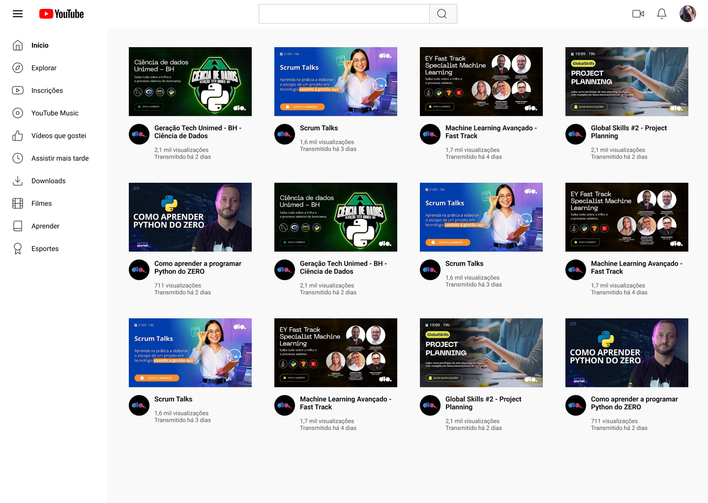

# Desafio de Layout Grid - DIO: Clone da Página Inicial do Youtube

[Clique aqui](https://ferrgusttavo.github.io/css-grid-youtube/) para acessar o resultado final do clone da Página do Youtube criada a partir do desafio!

Neste Desafio você colocará a mão na massa e irá clonar a página do YouTube com CSS colocando em prática todos os conceitos aprendidos, principalmente sobre Layout Grid.

[Link do Figma](https://www.figma.com/file/KknwioExyqKD3D2eSVFrcW/Desafio-Grid---DIO?type=design&node-id=1-2&t=ZXhkF6VZuRMytrOP-0) contendo o protótipo do desafio que usei para me basear.

